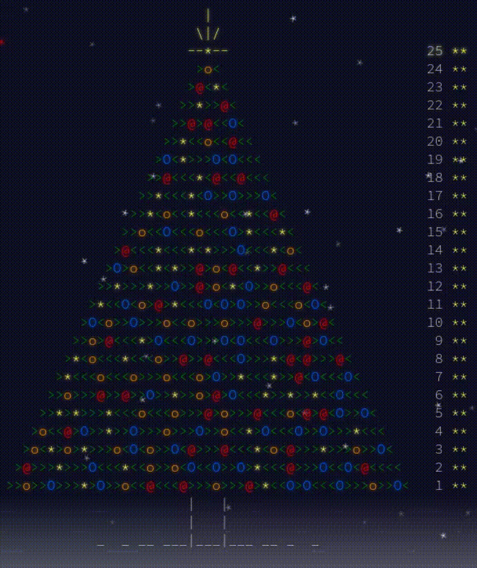

# Advent of Code 2015

**Not following advent calendar**. My verdict: This year felt easier than AoC 2024 in terms of the algorithmic
complexity of the problems. When I first returned to coding in C after using Python, it felt like I was typing on a
typewriter: everything seemed mechanical and tedious. But over time, I began to appreciate the language. C strikes a
good balance: it's abstracted enough from machine language to be practical, yet it's still close enough to the hardware,
especially in terms of memory management (learning what the heap and stack are in nand2tetris part 2 was key to
understanding allocation). C has also evolved significantly, for instance, single-header-file libraries like `stb_ds`
are incredibly useful. They let you add dynamic arrays and hash tables to your code in a straightforward, pragmatic way.



## Usage

The [Makefile](./Makefile) can help compile and run:

```shell
# Run first day's solution1.c with "example" as input
make run DAY=01 PART=1 IN=example
```
