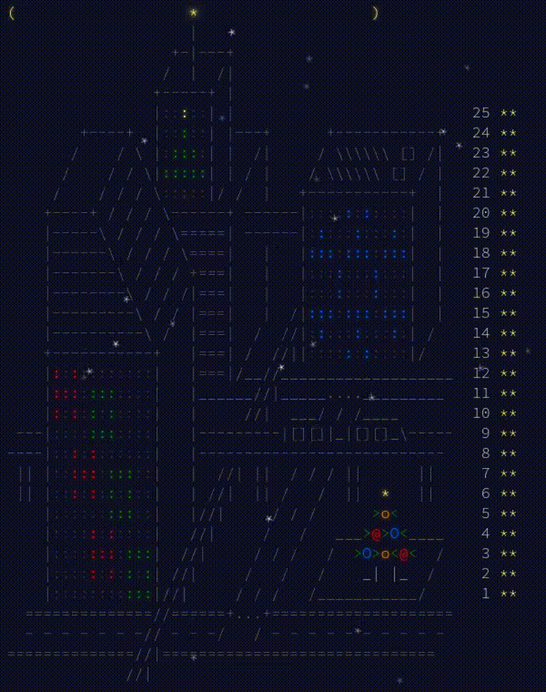

# Advent of Code 2016

**Not following advent calendar**. My verdict: This year's problems were slightly harder than 2015.
Day 11 noticeably difficult. Favorite problem: day 24 by far. I knew how to solve it as soon as I
read it but it got me to implement A* and memoization in C and use them along with DFS.
C feels great in 2026.



## Usage

The [Makefile](./Makefile) can help compile and run:

```shell
# Run first day's solution1.c with "example" as input
make run DAY=01 PART=1 IN=example
```
