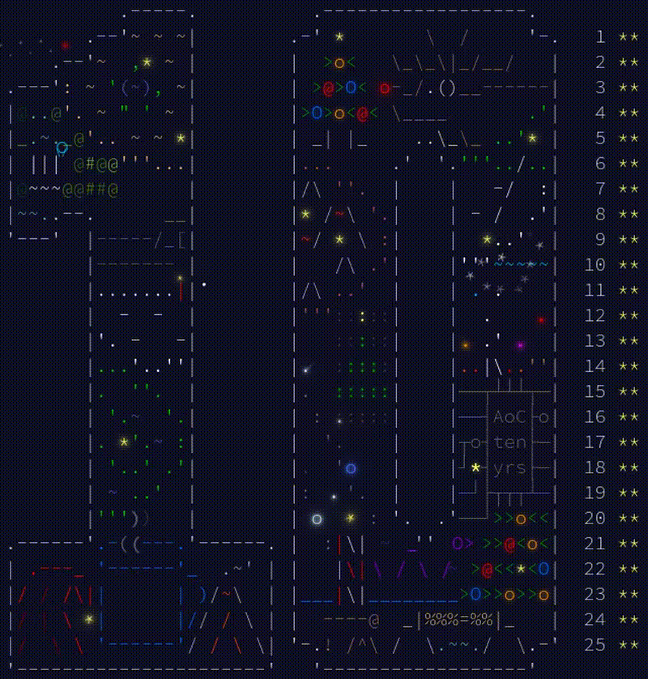

# Advent of Code 2024

**Not following advent calendar**. My verdict: I don't think I would have been able to follow the advent calendar
because days 17, 21, and 24 were particularly difficult (although the rest were manageable). Moreover, 25 straight days
of solving coding problems would have been daunting.

## Usage

We use self-contained [`uv`](https://docs.astral.sh/uv/) scripts:

1. [Install `uv`](https://docs.astral.sh/uv/getting-started/installation/)
2. Run the solution passing the input file as first argument, for example: `./solution2.py input`

## On AI being able to solve Advent of Code problems

After completing 2025 and this year, it’s clear to me that turning a problem into an efficient algorithmic solution 
such as dynamic programming, pathfinding, depth-first search with memoization, or some graph algorithm is a learnable
skill. I'm not surprised LLMs can solve "novel" problems just by finding analogies with computationally equivalent
problems in their corpora. This is not to undermine this capability AI has which is indeed fascinating.
