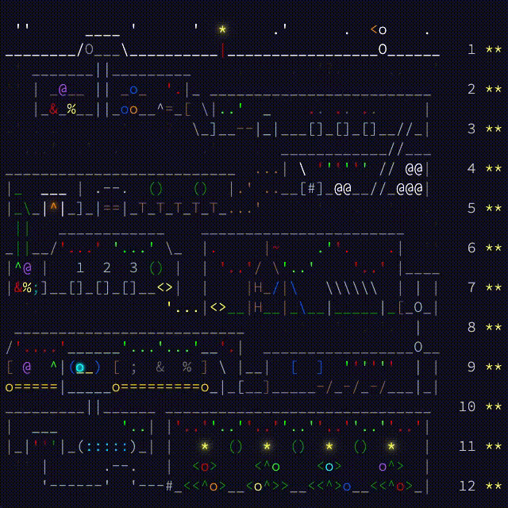
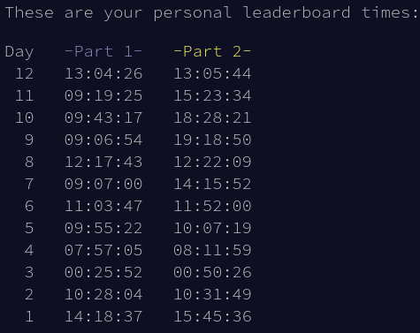

# Advent of Code 2025

In 2025, I followed the advent calendar, solving each puzzle the day it was published.
How would I describe the experience in a single word: **humbling**.





## Usage

Use your system's `python` or a virtual environment. Run a solution by piping the input into the solution script:

```shell
cat input | python solution1.py
```

In general, only the standard library is used. In some cases an external library is required:
 
- Day 9: `numpy` and `tqdm`
- Day 10: `scipy` for Mixed Integer Linear Programming (`scipy.optimize.milp`)
- Day 12: `cpmpy` for Constraint Programming (spoiler: just for the example)
